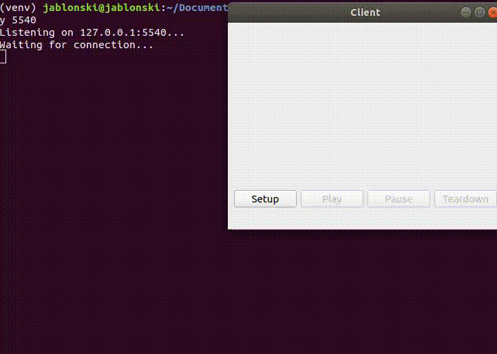

# RTSP and RTP streaming

### **DISCLAIMER: PYQT IS AVAILABLE THROUGH THE GPL LICENSE. THE MIT LICENSE ONLY APPLIES TO NON-PYQT CODE**

 Python implementation of the [programming assignment](http://media.pearsoncmg.com/aw/aw_kurose_network_3/labs/lab7/lab7.html) from the chapter "Multimedia Networking" (chapter 7 in the 6th edition) of the book "Computer Networking: A Top-Down Approach" by Jim Kurose.
 
 Implements basic RTSP and RTP streaming functionality using the standard Python 3 library, plus [PyQt5](https://pypi.org/project/PyQt5/) and [Pillow](https://github.com/python-pillow/Pillow) for stuff related to GUI. Further info available in the [assignment guide](http://media.pearsoncmg.com/aw/aw_kurose_network_3/labs/lab7/lab7.html) (from the 3rd edition, newer versions of the book might change the assignment slightly). Error handling is very minimal, reopening the server and client is required to run another session.

 ### **This implementation does NOT strictly follow the one provided by the book authors**



## Installation

Clone the repository with `git clone https://github.com/gabrieljablonski/rtsp-rtp-stream`.

Having python>=3.6 installed, create a virtual environment by running `python -m venv venv` inside the cloned folder.

Activate the virtual environment (`source venv/bin/activate` on Linux, `.\venv\Scripts\activate` on Windows).

Install the requirements with `python -m pip install -r requirements.txt`.

## Usage

Go to the sources folder with `cd src/` (video stream class assumes `mjpeg` file is in working directory).

Server should be run first with 
```
python main_server.py <port> 
```
In which `port` is the port number for the RTSP socket to listen on.

Client can then be run with 
```
python main_client.py <file name> <host address> <host port> <RTP port>
```
in which `file name` is the name for the file to be sent via RTP (`movie.mjpeg` is the available sample), `host address` is the server address (`localhost` if running on same machine), `host port` is the port selected when running the server, `RTP port` is the port for receiving the video via RTP.

Since you're probably running each instance on separate terminals, remember to activate the venv on both.

Suggested configs are:
```
python main_server.py 5540
python main_client.py movie.mjpeg localhost 5540 5541
```
